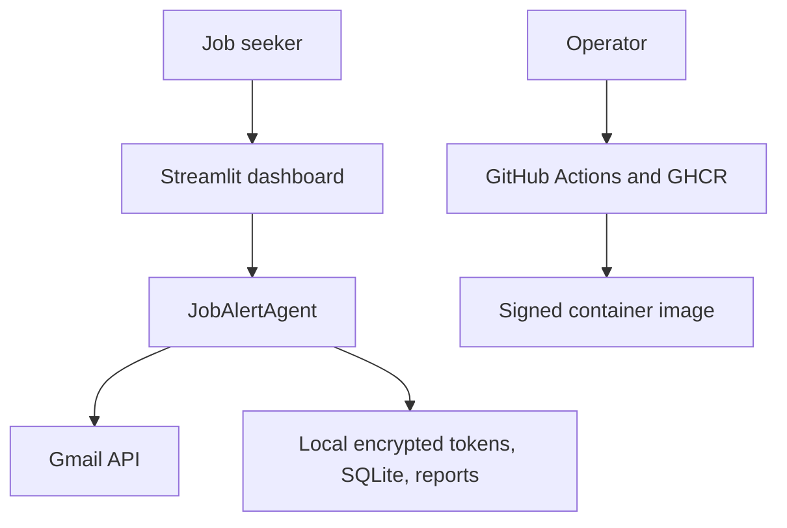
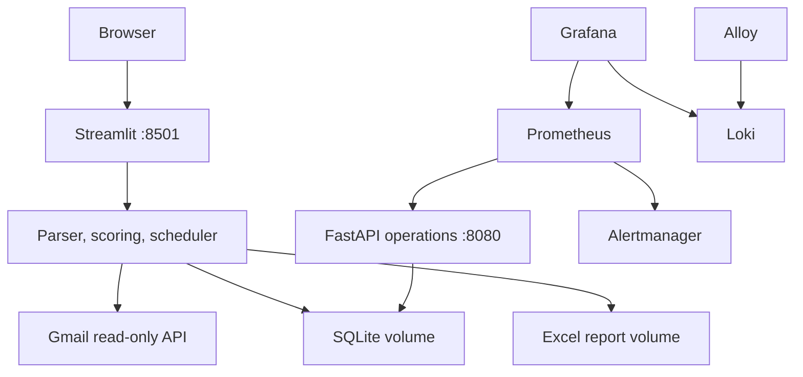
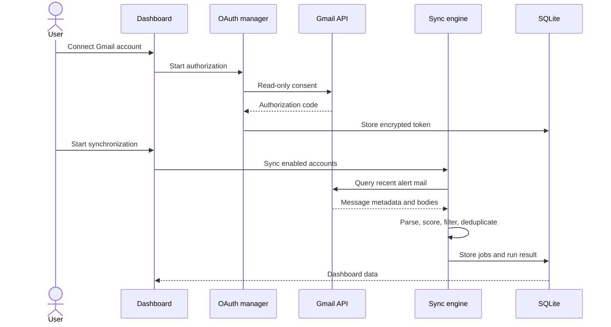
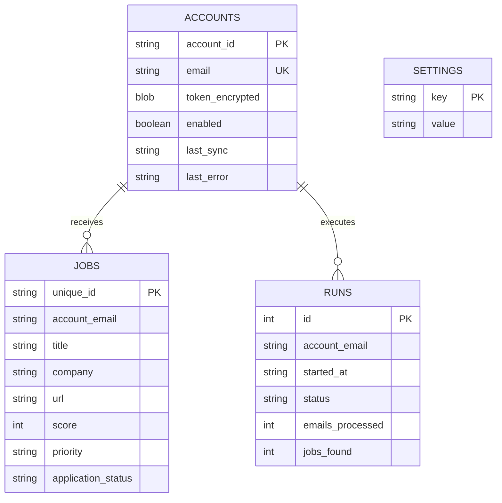
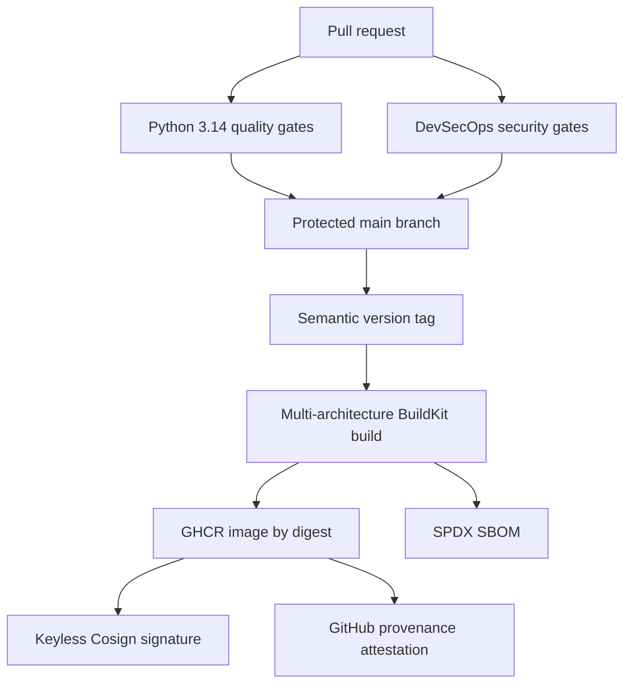

# System architecture

## Context

JobAlertAgent is an offline-first personal job-alert processor. Gmail is the only external data source. Email content, OAuth tokens, the SQLite database, and reports remain on the operator-controlled host.

## Runtime containers

## Email processing sequence

## Data model

## Delivery and trust chain

## Design boundaries

- Gmail access is read-only; the service never needs a Gmail password.
- SQLite is intentionally single-host and offline-first, not a shared multi-node database.
- Scoring is deterministic and explainable; no email is sent to an LLM.
- Operations endpoints expose aggregate counts and must never expose email addresses or tokens.
- Monitoring is suitable for a single trusted deployment. Internet exposure requires TLS and authentication at a reverse proxy.
