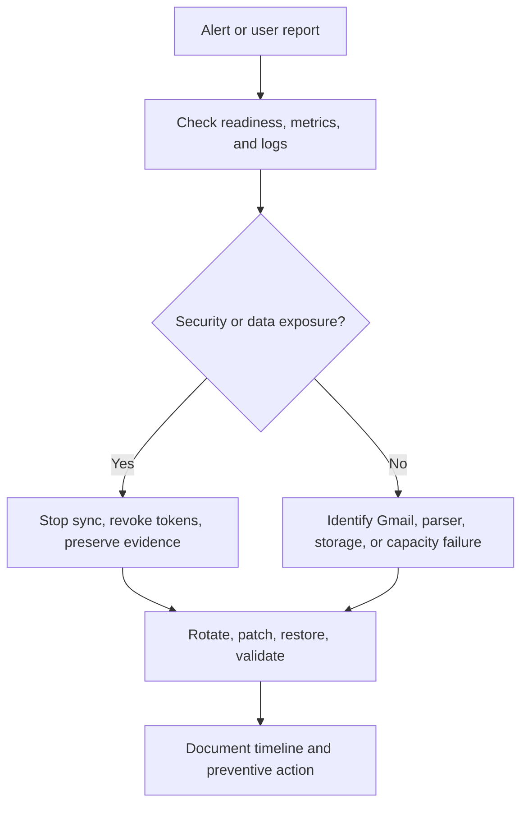

# Operations runbook

## Start and verify

```bash
docker compose -f compose.yaml -f compose.monitoring.yaml up --build -d
curl --fail http://localhost:8080/health/live
curl --fail http://localhost:8080/health/ready
curl --fail http://localhost:8080/metrics
```

## Incident flow



## Common failures

| Symptom | Checks | Recovery |
|---|---|---|
| Readiness `503` | Response check map, mounts, configuration permissions | Restore missing mount or valid configuration; do not bypass readiness |
| Gmail authorization error | Test-user status, redirect URI, revoked consent | Reauthorize affected account; never request a password |
| Sync failures increase | Loki logs, Gmail availability, sender filters | Retry after dependency recovery; update parser only with tests |
| No new jobs | Time window, sender domain, filters, deduplication | Confirm source mail and relax filters deliberately |
| Report write failure | Report-volume ownership and free space | Restore writable volume and rerun report generation |
| Database corruption | Stop writers and preserve damaged file | Follow backup and recovery runbook |
| High disk usage | Database, reports, logs, Prometheus retention | Archive or delete according to retention policy |

## Escalation levels

- **SEV-1:** confirmed token/data exposure or destructive data loss; stop affected services immediately.
- **SEV-2:** all synchronization unavailable or database unusable.
- **SEV-3:** one account/source unavailable or monitoring degraded.
- **SEV-4:** documentation, cosmetic, or non-urgent operational issue.

After SEV-1 or SEV-2, record impact, timeline, root cause, corrective actions, and owners without placing secrets in the issue.
