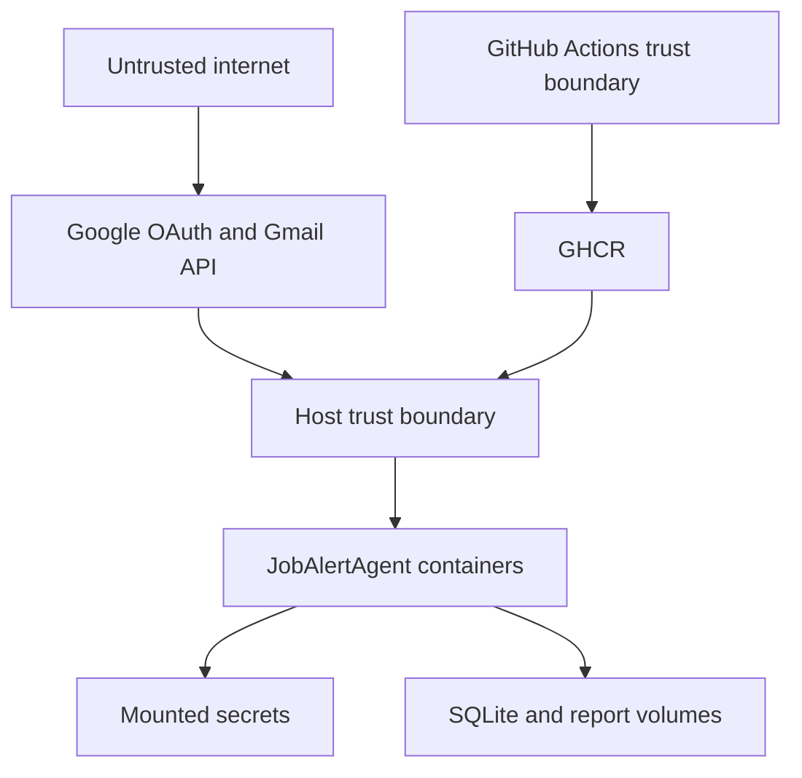

# Threat model

## Assets

- Gmail OAuth refresh tokens and encryption key
- Email-derived job and account data
- SQLite database and generated reports
- Release signing identity, attestations, and container images

## Trust boundaries

## Principal threats and controls

| Threat | Control | Residual risk |
|---|---|---|
| Token theft | Fernet encryption, mounted secret files, Git ignores, restricted permissions | Host compromise can expose key and ciphertext together |
| Malicious email HTML | BeautifulSoup parsing, no script execution, bounded stored context | Parser denial-of-service from unusually large messages |
| OAuth account confusion | Google-returned profile is authoritative; entered email is only a hint | User may authorize an unintended account |
| Dependency compromise | Dependabot, pip-audit, Trivy, CodeQL, signed image and SBOM | Newly disclosed issues before database update |
| Secret committed to Git | Gitleaks and review policy | Previously published history needs explicit revocation |
| Metrics leak personal data | Aggregate metrics without email labels | Logs require continued redaction discipline |
| Container privilege abuse | Non-root runtime user, read-only monitoring mounts | Host Docker access remains privileged |
| Tampered release | Protected environment, OIDC signing, provenance, digest verification | Compromised GitHub administrator could alter policy |

## Security assumptions

- The host and mounted secret directory are trusted and access-controlled.
- The dashboard is bound to a trusted network unless protected by authenticated TLS ingress.
- GitHub branch and environment protection are enabled by a repository administrator.
- Operators rotate credentials after any suspected exposure.

Review this model for every new external integration, public deployment, authentication change, or storage backend.
